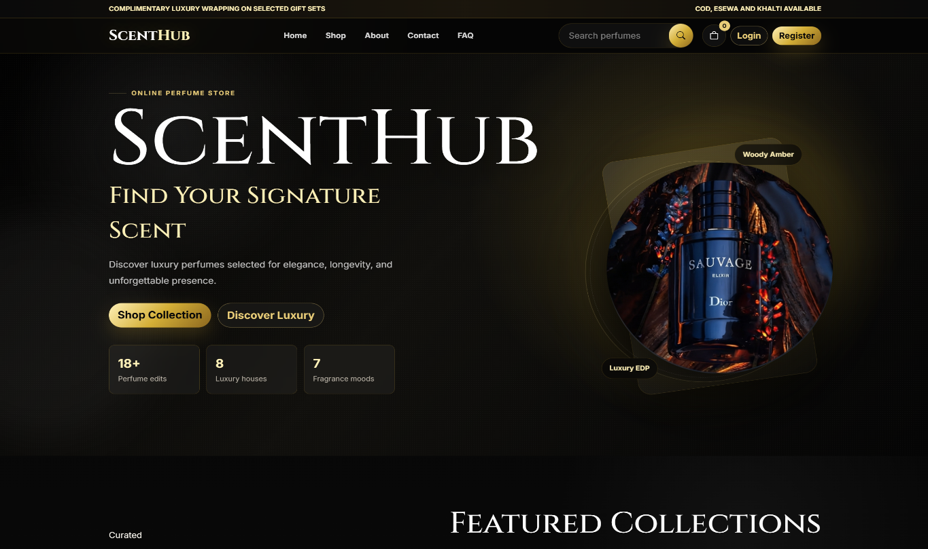
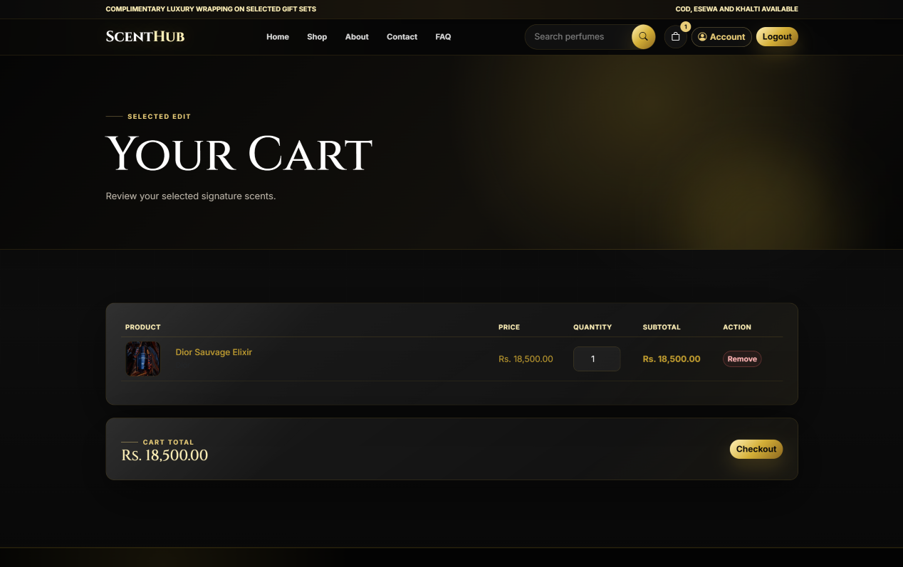
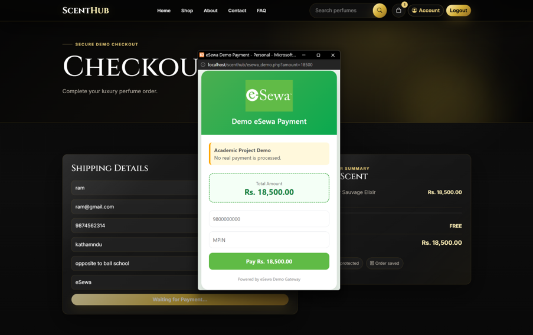
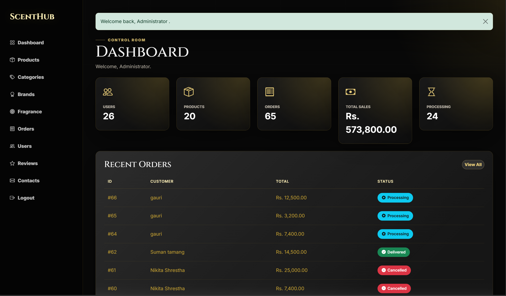
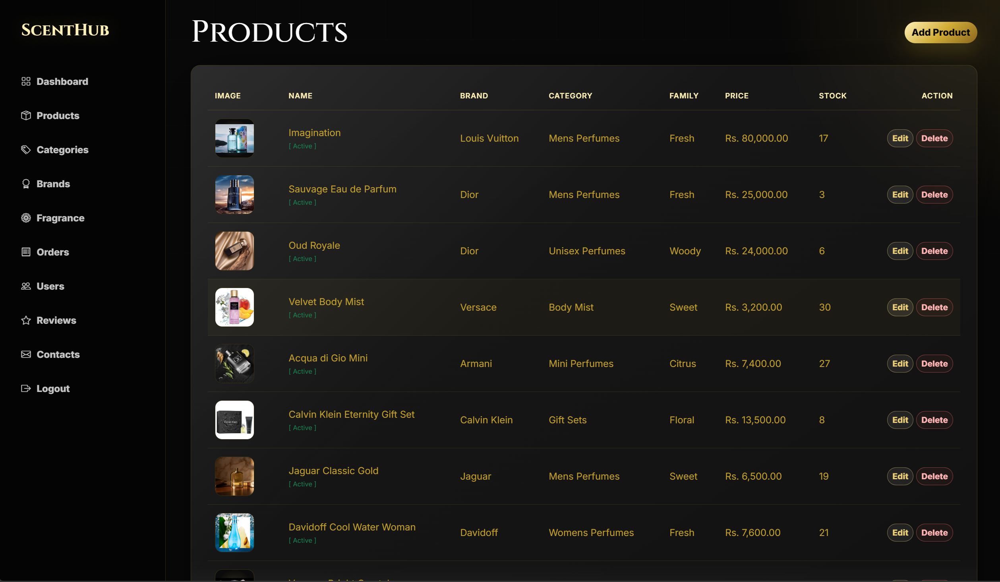

# SCENTHUB

### An Online Fragrance Store and Management System

ScentHub is a web-based fragrance store and management system developed as a BCA project. The system provides customers with an online platform to browse fragrances, manage their cart, place orders, make demo online payments, and submit product reviews. Administrators can manage products, categories, brands, orders, users, reviews, and customer messages through an administrative panel.

---

## Features

### Customer Features

* User registration and login
* Secure password authentication
* Browse fragrance products
* Search and filter products
* View product details
* Add products to cart
* Update cart quantities
* Select specific cart items for checkout
* Checkout selected products
* Cash on Delivery option
* eSewa demo payment
* Khalti demo payment
* View order history
* View individual order details
* Submit reviews after a delivered order
* Contact the store through the contact form
* Session-based cart handling

### Admin Features

* Admin authentication and access control
* Dashboard with store statistics
* Product management
* Category management
* Brand management
* Fragrance family management
* Order management
* User management
* Review management
* Contact message management
* Product image uploads
* Order status management
* Stock management

---

## Technologies Used

### Frontend

* HTML5
* CSS3
* Bootstrap 5
* JavaScript
* Bootstrap Icons

### Backend

* PHP
* MySQL / MariaDB

### Development Environment

* XAMPP
* Apache
* MySQL
* Visual Studio Code

---

## User Roles

### Customer

Customers can:

* Create an account
* Browse products
* Add products to their cart
* Select products for checkout
* Place orders
* Make demo payments
* Track their orders
* Submit product reviews after delivery
* Send contact messages

### Administrator

Administrators can manage the main operations of the store, including:

* Products
* Categories
* Brands
* Fragrance families
* Orders
* Users
* Reviews
* Contact messages

---

## Payment System

ScentHub currently includes **demo/sandbox payment flows** for:

* eSewa
* Khalti

These payment pages are implemented for project demonstration purposes and are **not connected to the production payment gateways**.

The checkout process uses a server-generated payment session and validates the payment state before allowing an online-payment order to be placed.

Cash on Delivery is also available.

---

## Database

The project uses MySQL/MariaDB with the database name:

```text
scenthub_db
```

Main database tables include:

* `users`
* `products`
* `categories`
* `brands`
* `fragrance_families`
* `cart`
* `orders`
* `order_items`
* `payments`
* `reviews`
* `contact_messages`

The database uses relationships between users, products, carts, orders, order items, payments, and reviews to maintain data consistency.

---

## Security Features

ScentHub includes several security measures:

* Password hashing using PHP password hashing functions
* Password verification during login
* Prepared SQL statements
* CSRF protection for POST operations
* Session-based authentication
* Session regeneration after login
* Role-based admin access control
* User-specific order access
* Server-side stock validation
* Server-side checkout validation
* Restricted review submission
* Restricted cart ownership
* Secure product image upload validation
* MIME type validation for uploaded images
* Randomized uploaded filenames
* Upload file size restrictions
* UTF-8 / `utf8mb4` database encoding
* Foreign key constraints
* Unique constraints for important records

---

## Project Structure

A simplified project structure is shown below:

```text
scenthub/
│
├── admin/
│   ├── dashboard.php
│   ├── products.php
│   ├── add_product.php
│   ├── edit_product.php
│   ├── categories.php
│   ├── brands.php
│   ├── fragrance.php
│   ├── orders.php
│   ├── users.php
│   ├── reviews.php
│   └── contacts.php
│
├── assets/
│   ├── css/
│   ├── js/
│   ├── images/
│   └── uploads/
│
├── config/
│   └── db.php
│
├── includes/
│   ├── functions.php
│   └── ...
│
├── cart.php
├── checkout.php
├── orders.php
├── product.php
├── login.php
├── register.php
├── contact.php
├── esewa_demo.php
├── khalti_demo.php
└── index.php
```

---

## Requirements

To run ScentHub locally, you need:

* XAMPP
* Apache
* MySQL or MariaDB
* PHP 8.x
* A modern web browser

---

## Installation

### 1. Install XAMPP

Install XAMPP with Apache and MySQL/MariaDB.

### 2. Copy the Project

Place the project inside the XAMPP `htdocs` directory:

```text
C:\xampp\htdocs\scenthub
```

### 3. Start XAMPP

Start:

```text
Apache
MySQL
```

from the XAMPP Control Panel.

### 4. Create the Database

Open phpMyAdmin and create:

```text
scenthub_db
```

Import the project's SQL database file into the database.

### 5. Configure the Database

Update the database configuration in:

```text
config/db.php
```

according to your local MySQL configuration.

### 6. Run the Project

Open:

```text
http://localhost/scenthub/
```

## Screenshots

### Home Page



### Product Listing


### Product Details


### Shopping Cart



### Checkout



### Admin Dashboard



### Product Management



---

## Main System Modules

| Module               | Description                                     |
| -------------------- | ----------------------------------------------- |
| Authentication       | User registration, login and session management |
| Product Management   | Add, edit and manage fragrance products         |
| Category Management  | Manage product categories                       |
| Brand Management     | Manage fragrance brands                         |
| Fragrance Management | Manage fragrance families                       |
| Shopping Cart        | Add, update, select and remove products         |
| Checkout             | Process selected cart items and create orders   |
| Orders               | Manage customer orders and order status         |
| Payments             | Demo eSewa/Khalti and Cash on Delivery          |
| Reviews              | Customer product reviews                        |
| Users                | Admin management of customer accounts           |
| Contacts             | Manage customer contact messages                |

---

## Order Workflow

```text
Customer Registration/Login
          ↓
      Browse Products
          ↓
     Product Details
          ↓
       Add to Cart
          ↓
    Select Cart Items
          ↓
        Checkout
          ↓
   Select Payment Method
          ↓
 ┌────────┼──────────────┐
 ↓        ↓              ↓
COD     eSewa Demo    Khalti Demo
 └────────┼──────────────┘
          ↓
      Place Order
          ↓
     Order Created
          ↓
    Admin Processes
          ↓
      Delivered
          ↓
    Customer Review
```

---

## Stock Management

ScentHub validates product stock during cart updates and order processing.

Customers cannot place an order for a quantity greater than the available stock. Stock is also handled during order status changes, including cancellation.

---

## Future Improvements

Possible future improvements include:

* Integration with production payment gateways
* Email notifications
* Advanced product recommendation system
* Customer wishlist
* Discount and coupon management
* Sales reports and analytics
* Improved order tracking
* Product inventory reports
* Deployment to a production server

---

## Project Purpose

ScentHub was developed to demonstrate the practical implementation of a web-based e-commerce and management system using PHP, MySQL/MariaDB, HTML, CSS, Bootstrap, and JavaScript.

The project focuses on implementing common e-commerce workflows such as authentication, product management, shopping cart operations, checkout, orders, payments, reviews, and administrative management.

---

**Rudra Bahadur Karki**

---

## License

This project was developed for academic and educational purposes.
